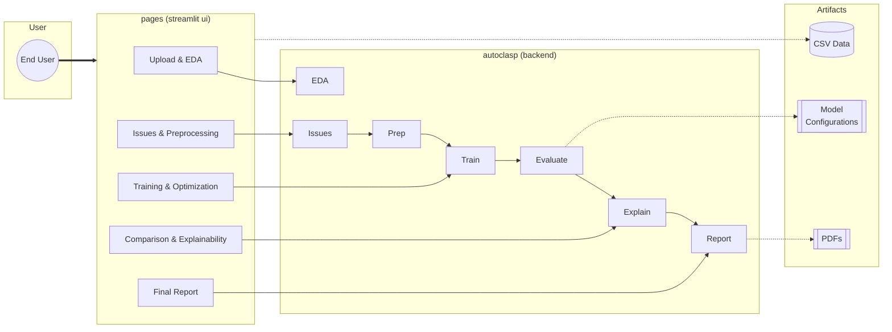
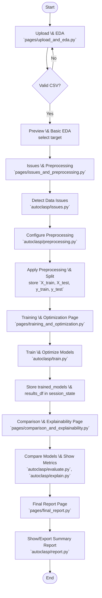

AutoClasP — AutoClassPredictor
==============================

Summary
-------
AutoClasP is a Streamlit\-based automated supervised classification pipeline that guides users from raw data to trained, evaluated, and explainable classification models with minimal effort. Designed for students, beginner data analysts, and domain experts.

Key features
------------
- Automated EDA and issue detection (missing values, duplicates, constant columns, high cardinality, class imbalance).  
- Configurable preprocessing pipelines (encoding, scaling, feature selection).  
- Multi-model training with stratified Cross Validation and Grid/Random hyperparameter search.  
- Evaluation leaderboard (accuracy, F1, ROC\-AUC), confusion matrices, and model explainability (SHAP).  
- Streamlit UI pages for upload, EDA, preprocessing, training, comparison, and final report export.  
- Exportable diagrams and a downloadable PDF report.

Try it yourself
-----------
[autoclasspredictor.streamlit.app](https://autoclasspredictor.streamlit.app/)

Getting started
---------------
1. Clone the repo and create a venv with reauirements installed:
   ```bash
   python -m venv .venv
   .\.venv\Scripts\activate
   pip install -r requirements.txt
   ```
2. Run the app:
   ```bash
   streamlit run app.py
   ```
3. Upload your dataset, select the target column and start exploring.

Repository layout
-----------------
- `app.py` — Streamlit entry, routing and session management  
- `autoclasp/` — core modules: `eda.py`, `issues.py`, `preprocessing.py`, `train.py`, `evaluate.py`, `explain.py`, `report.py`  
- `pages/` — Streamlit pages: `upload_and_eda.py`, `issues_and_preprocessing.py`, `training_and_optimization.py`, `comparison_and_explainability.py`, `final_report.py`  
- `utils/` — helpers: `data_utils.py`, `plotting.py`, `recommendations.py`, `sccoring.py` (none used as of now) 
- `data/` — assets like logo etc (can add a dummy dataset)

Core workflow (high level)
--------------------------
1. Upload dataset → 2. Automatic EDA & issues detection → 3. Configure preprocessing → 4. Split data & fit pipelines → 5. Select models & CV settings → 6. Train \& tune (Grid/Random) → 7. Evaluate, compare, explain → 8. Export report

Architecture diagram
------------------------------
Paste this block into `README.md` or GitHub to render the architecture graph:



Flowchart diagram 
--------------------------



Contributors
------------
- [Ahmad Faiz](https://www.linkedin.com/in/ahmadfaiz01/)
- [Arham Ali](https://www.linkedin.com/in/arham-ali-8981612b8/)


Contact
-------
Incase of query or issues:
[Email Me](mailto:ahmad.bscs23seecs@seecs.edu.pk)
